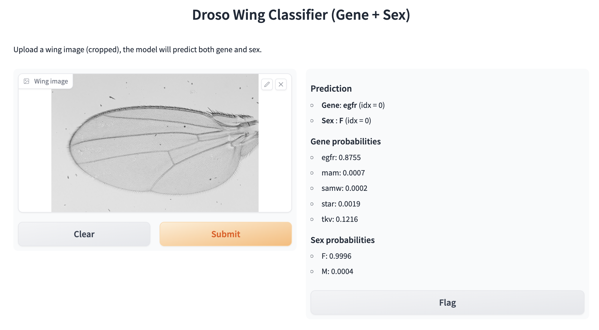

Usage
=====

Command-Line Batch Inference
----------------------------

For large-scale evaluation on a folder of wing images, use the batch inference
script:

.. code-block:: bash

   python batch_inference_v2.py \
       --img_dir ./data/crop_testing \
       --out_csv ./output/batch_inference_gene_sex.csv

The script scans ``img_dir``, applies the full preprocessing and fusion-model
pipeline to each image, and writes results to the CSV file given by
``--out_csv``.

The output table contains, for each image:

* the file name,
* the predicted gene,
* the predicted sex, and
* the full probability distributions over all gene and sex classes.

Gradio Web Interface
--------------------

For interactive exploration, launch the Gradio app:

.. code-block:: bash

   python app_inference_v2.py

This starts a local web server, typically at ``http://127.0.0.1:7860``.

The web page consists of:

* an image upload panel on the left, and
* a prediction panel on the right.

After uploading a cropped wing image and clicking *Submit*, the application
displays:

* the predicted gene label,
* the predicted sex label, and
* bar plots of the class probabilities.

This interface is useful for quickly inspecting individual wings and
understanding how confidently the model predicts each class.
